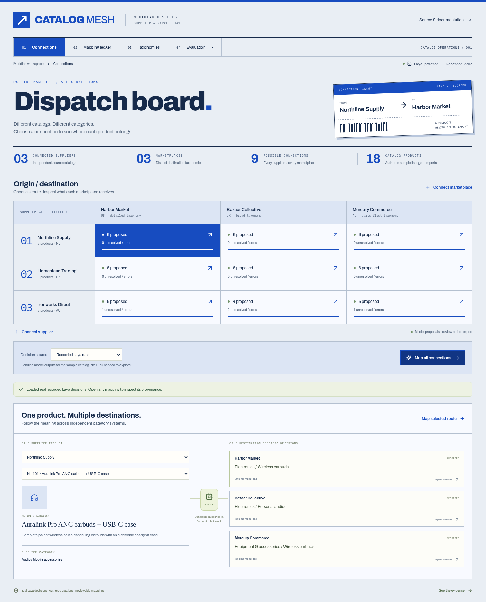

<div align="center">

# CatalogMesh

**Many suppliers. Many marketplaces. One semantic mapping engine.**

A reseller workbench that uses **real Laya inference** to map products into each
destination marketplace's category system.

[Quickstart](#quickstart) · [Live Laya](#run-live-laya) · [Evaluation](#evaluation-and-regression-gates) · [Architecture](docs/architecture.md)

</div>



The interface is a dispatch board: a printed origin/destination grid, numbered suppliers, and a connection ticket that updates with the selected route. The layout adapts to mobile and serves its fonts locally.

## What works today

- Connect independent supplier catalogs and marketplace taxonomies through JSON imports.
- Run any connected supplier–marketplace combination within the demo's batch limits.
- Inspect Laya's category choice, candidate probabilities, lexical baseline and provenance.
- Review or correct a mapping without changing the original model prediction.
- Version taxonomy changes and identify stale mappings.
- Export destination mappings as CSV or a complete decision as JSON.
- Explore **54 genuine recorded Laya decisions** without downloading a model.
- Run the same pipeline locally on new data using a pinned Laya checkpoint.

The bundled workspace contains **three fictional suppliers, three fictional marketplaces,
18 products and nine connections**. Marketplaces deliberately use different category
granularity and organization. They are not integrations with commercial marketplaces.

**Research preview:** current Laya mapping accuracy is **72.2% on 72 authored evaluation
decisions**, versus **62.5% for lexical retrieval alone**. The model fails the declared
80% accuracy and 50% unmatched-recall gates. It must not be used to publish unattended
catalog mappings. See the failure explorer and [full evaluation](evals/README.md).

### Laya → Bedrock experiment

The repository also includes a reproducible comparison of **Laya alone, Claude Sonnet 4.6
on Amazon Bedrock, and a fixed 95% Laya-score cascade**. It tests the existing regression
set and a separately frozen set of new authored products, records every model response,
and measures exact decisions, wrong accepted mappings, unresolved products, latency and
Bedrock token usage. See the [measured verdict](evals/cascade/REPORT.md) and
[benchmark instructions](evals/cascade/README.md).

This is an offline experiment. The workbench's mapping buttons still use Laya; they do
not invoke Bedrock or automatically publish mappings. A successful `unmatched` decision
can still require supplier information or a human workflow.

## Quickstart

Requirements: Python 3.11+, [uv](https://docs.astral.sh/uv/), Node.js 22.12+.

```sh
git clone https://github.com/debojitroy/CatalogMesh.git
cd CatalogMesh
uv sync
npm ci
npm run build
uv run uvicorn catalogmesh.main:app --host 127.0.0.1 --port 8110
```

Open **http://127.0.0.1:8110**.

1. Click **Map all connections** to load the recorded Laya decisions.
2. Explore one product's different destination categories.
3. Click a destination to inspect the actual model output, then save a review.
4. Open **Evaluation** to inspect mistakes and quality gates.
5. Import a new supplier or marketplace. New data requires live inference.

Recorded mode matches the exact sample product content, taxonomy, retrieval and question
fingerprint. It rejects new or edited inputs rather than fabricating predictions.
The displayed model timings are those of the original recorded calls, not replay latency.

The API serves the built frontend. SQLite state is saved in `data/catalogmesh.db`.
Use **one API worker**: the current execution queue belongs to that process.

## Why Laya is central

A supplier's “Audio accessories” can contain complete earbuds, electronic replacement
charging cases, protective silicone covers and replacement ear tips. Different marketplaces
split or group those products differently.

CatalogMesh:

1. Retrieves five candidate categories with a transparent lexical TF-IDF baseline.
2. Gives Laya the actual product text and meaningful destination category names/definitions.
3. Laya chooses a category or `unmatched`.
4. Maps that semantic choice back to the marketplace's category ID.

There are **no SKU-to-answer rules** in this pipeline. Fixture expected labels are used
only for offline evaluation. Laya's output determines the proposed destination.

Opaque marketplace IDs are kept out of model labels. The initial adapter using IDs such as
`H-101` scored only 25%; the failed run is retained in `evals/history/`. Renaming storage
IDs must not change the text sent to the model, and a regression test enforces that contract.

Candidate probabilities are conditional on the shortlist plus `unmatched`. They are not
calibrated estimates of correctness. Every mapping starts as a proposal; review is explicit.
The UI shows original evidence, not an invented explanation attributed to Laya.

## Run live Laya

The default checkpoint is the English [Laya](https://huggingface.co/convaiinnovations/laya)
model at revision `55cf4c4ebb4ebe31b2550e8bdf3bd21b99753851`.
This repo pins `laya==0.3.20`. Model weights download from Hugging Face on first use and
are not redistributed here.

```sh
uv sync --extra inference
uv run uvicorn catalogmesh.inference:app --host 127.0.0.1 --port 8120
```

The worker uses CUDA when available and otherwise CPU. To choose explicitly:

```sh
CATALOGMESH_DEVICE=cpu uv run uvicorn catalogmesh.inference:app --host 127.0.0.1 --port 8120
```

In a second terminal:

```sh
CATALOGMESH_ENABLE_LIVE=true uv run uvicorn catalogmesh.main:app --host 127.0.0.1 --port 8110
```

Select **Live Laya** in the workbench. New products and destination taxonomies now go
through real inference.

`CATALOGMESH_LAYA_URL` configures an operator-controlled worker endpoint. The worker exposes
`GET /health` and `POST /predict` with `{state, questions}`, returning `{result, model_ms,
metadata}`. This is CatalogMesh's thin Laya adapter, not the upstream `laya-serve` wire API.
Browser users cannot supply arbitrary worker URLs.

To evaluate another Laya checkpoint, set **both** `CATALOGMESH_MODEL_REPO` and
`CATALOGMESH_MODEL_REVISION` on the worker. Use an immutable revision and rerun the evals.
There is no fallback from a failed live call to a recorded answer.

The worker validates category count and token budgets, rejecting oversized inputs rather
than silently truncating product evidence. Category descriptions should be concise.

### Hardware and measurements

The checked-in English recordings used a Tesla T4, PyTorch 2.12.1+cu130 and Transformers
5.12.1. Exact metadata and timings are included in every recording.

The evaluation's warm p50 model call was approximately **39 ms**. This includes Laya
tokenization, inference and output decoding, excludes retrieval/network/queue time, and is
not a throughput measurement. CPU inference is supported but was not benchmarked here.

Recorded mode needs no GPU, model download or API key. Live inference requires sufficient
memory for the checkpoint and its framework; the measured T4 has 16 GB VRAM.

## Bring your catalogs

**Connect supplier** accepts:

```json
{
  "id": "supplier-1",
  "name": "Example supplier",
  "region": "EU",
  "products": [
    {
      "id": "SKU-1",
      "title": "Protective silicone earbud case cover",
      "description": "Soft protective shell only. No electronics or earbuds.",
      "source_category": "Mobile audio",
      "brand": "Example"
    }
  ]
}
```

**Connect marketplace** accepts:

```json
{
  "id": "market-1",
  "name": "Example marketplace",
  "region": "US",
  "version": "1",
  "categories": [
    {
      "id": "CAT-101",
      "path": "Audio / Headphones",
      "description": "Complete headphones and earbuds."
    },
    {
      "id": "CAT-102",
      "path": "Audio / Protective covers",
      "description": "Non-electronic protective covers for earbud charging cases."
    }
  ]
}
```

Updating a taxonomy definition requires a new version. Previous decisions preserve the
taxonomy they used. Reviews are scoped to one product/destination decision; they do not
silently alter other marketplaces or train the model.

## Evaluation and regression gates

```sh
uv sync --extra dev
uv run pytest -q
uv run ruff check server scripts
uv run python scripts/check_eval.py
```

These verify recorded-result integrity, case coverage, label separation, identifier
invariance, cache invalidation, API failures, review persistence and export behavior.
They do not call the model.

**Absolute model-quality gate (currently fails):**

```sh
uv run python scripts/check_eval.py --quality
```

**Live regression run** with the Laya worker running:

```sh
uv run python scripts/record.py --kind eval --output data/eval-candidate.json
uv run python scripts/check_eval.py --report data/eval-candidate.json \
  --compare evals/baseline.json --quality
```

`record.py` writes the report even when quality gates fail, then exits nonzero.
Run the comparison command afterward to see case-level regressions. Previously correct
decisions lost by a candidate fail the comparison, even if aggregate accuracy is unchanged.
The default output is in ignored `data/`; it never automatically overwrites the committed baseline.

GitHub runs **Software checks** and **Model quality** separately. A green software build
does not imply model quality passed. The initial model-quality check is intentionally red
because the measured model does not meet the predeclared pilot bars.

See [evals/README.md](evals/README.md) for dataset scope, history and interpretation.

## Development

Run the API on port 8110 and `npm run dev` in another terminal. Vite runs on port 5174.

```sh
npx playwright install chromium
npm run test:e2e
```

Browser tests cover many-to-many mapping, decision inspection, review, export, imports,
evaluation, mobile layout and automated accessibility. Stop any API on port 8110 first;
tests start their own isolated database and server.

## Scope and scale

This release is a working **bounded pilot**, not a million-product production deployment.
Limits are 200 products per imported supplier, 10,000 categories per taxonomy, 300 decisions
per batch, one active batch, and the latest 2,000 ledger entries in API responses.

At larger scale, durable distributed jobs, precomputed taxonomy indexes, batched model
inference, version-aware incremental processing, tenant isolation, and load testing are
required. See the [architecture and scale plan](docs/architecture.md).

There is no authentication, multi-tenant isolation, commercial marketplace publishing,
image classification, learned product deduplication, or automatic model training. The
local app shares its catalogs and run history with all connected users. Public deployments
should use recorded mode or add access control before enabling inference and private catalogs.

## License

CatalogMesh code, authored fixtures and evaluation labels are [MIT licensed](LICENSE).
Laya code and checkpoints retain their upstream [Apache 2.0 license](https://github.com/NandhaKishorM/laya/blob/main/LICENSE).
No model weights are bundled. Names and listings in the sample workspace are fictional.
