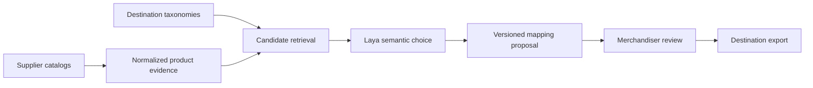

# CatalogMesh architecture

## Mapping contract

The reseller connects independent supplier feeds to independent marketplace taxonomies.
A decision is specific to one product and one destination taxonomy version.

The lexical TF-IDF retriever shortlists five categories. It does not inspect labels or
use SKU-specific rules. Laya sees the product and readable candidate names/definitions.
The app maps the semantic choice back to a destination ID and preserves the full
candidate distribution and provenance. `unmatched` is a valid model choice.

An internal reseller category must not replace original product details: a coarse
intermediate category can discard information required by a more granular destination.

## Current implementation

- React/TypeScript workbench: supplier–marketplace matrix, product fan-out, taxonomy
  definitions, mapping ledger, review and evaluation.
- FastAPI: catalog imports, bounded mapping jobs and exports.
- SQLite: catalog objects, job states and append-only mapping records. Reviews update
  a separate field on a mapping and preserve its original prediction.
- Optional local Laya service: one resident checkpoint, serialized inference and
  explicit token-budget validation.
- Checked-in recorded output: exact sample input fingerprints only.

There is no model call on the recorded path. Recorded timings are labeled accordingly.
The live path never substitutes a recording on an error. All failed rows remain visible.

## Going from a pilot to millions of listings

This is an implementation plan, not a measured capacity claim.

1. Store raw feed batches in object storage and normalized records in a tenant-scoped
   database. Separate a supplier's offer identity from product identity; reliable
   cross-supplier deduplication is its own problem.
2. Publish durable mapping jobs keyed by product-content hash, destination taxonomy
   version, retrieval/prompt version and model revision. Use idempotent writes,
   explicit leases, retry budgets and dead-letter handling.
3. Maintain destination indexes rather than rebuilding lexical statistics for each
   product. Benchmark retrieval recall before comparing decision models.
4. Group compatible inference requests and batch them through persistent workers.
   Different candidate sets may require separate Laya question-schema groups.
5. Cache unchanged decisions only within the full versioned key. Content, taxonomy,
   model or policy changes invalidate the appropriate results.
6. Reprocess only affected records after taxonomy edits, preserving previous proposals
   so a merchandiser can review category movements.
7. Add authentication, tenant isolation, role-based review, dataset retention and
   destination-specific export/publishing adapters.
8. Load-test peak ingestion, queue age, failure recovery, p95 end-to-end latency and
   cost per reviewed correct mapping before claiming million-product readiness.

Commercial marketplace categories may impose additional listing requirements. Correct
category selection alone does not guarantee that a marketplace will accept a listing.
